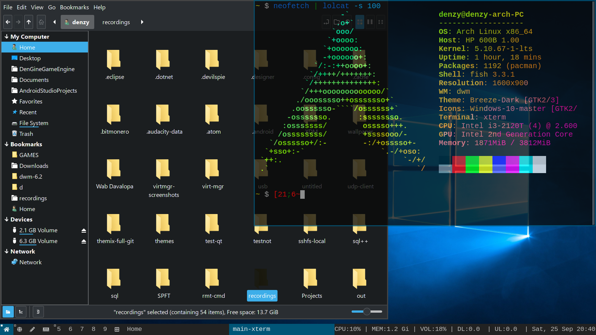
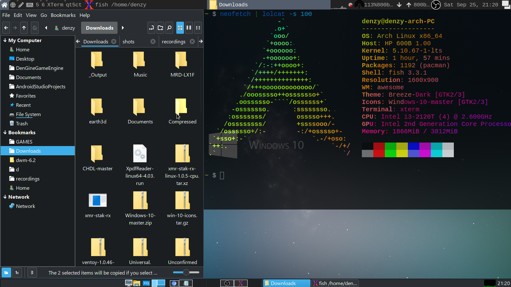

# installing
Simply run the script in fonts as root. It installs the `segoeui.tff` to fonts directory then reloads fontconfig cache.

From here you would then pick `Segoe UI Regular` font (the Windows font which is ironically open source)  in your apperance tool like `lxapperance` for GTK apps and `qt5ct` for Qt apps. 

Some DE's provide a way of uniformly using the same theme and icon for Qt and GTK apps (like cinnamon AFAIK)

Install the icon theme and pick a wallpapers in the `wallpapers` directory 

I recommend first installing the icon theme in `lxapperance` then picking it in something like `qt5ct` for Qt apps.

If Qt apps do not respond to changes check if `QT_QPA_PLATFORMTHEME=qt5ct` is in your environment (`/etc/environment`).

GTK apps should work with minimal to no configuration.

# themeing
I'd pair this with a good dark theme like [Breeze GTK](https://archlinux.org/packages/extra/any/breeze-gtk) or any of your liking!

# shots
DWM

Awesome + lxpanel

# notes
I'm not really a pro-ricer :laughing

`nemo` file manager integrates really well with the icons

Please view the [Sources](SOURCES.md) for the various sources of themes, icons and `segoeui.ttf`

